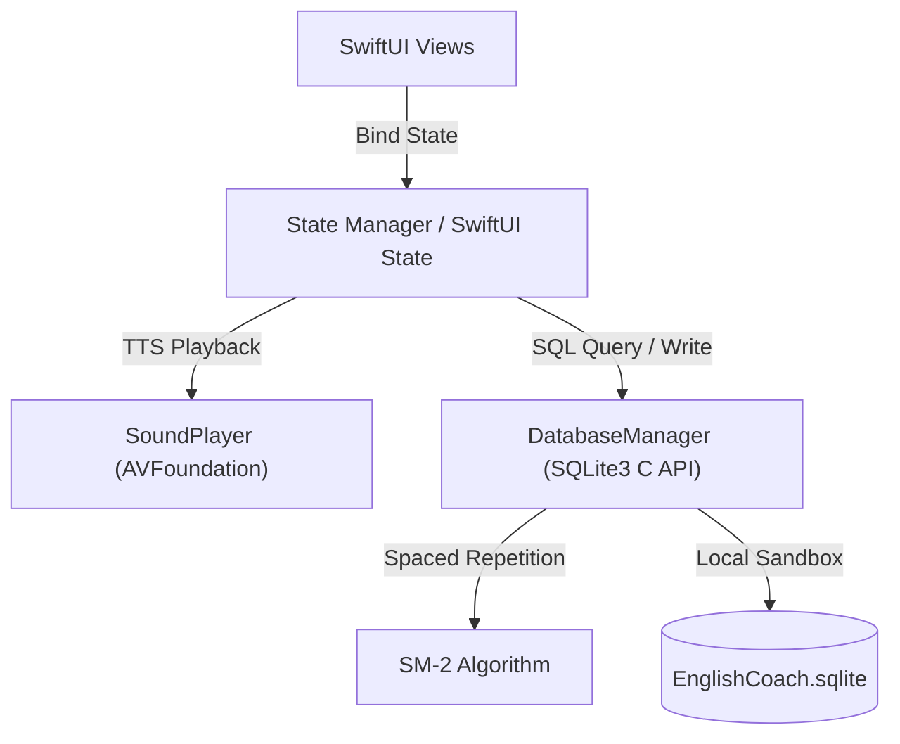

# EnglishCoach

[](https://swift.org)
[](https://developer.apple.com/ios/)
[](https://www.sqlite.org/)
[](LICENSE)

EnglishCoach is a premium, feature-rich native SwiftUI application designed for scientific English vocabulary learning on iOS. Powered by a local SQLite database seeded with 3,000 curated TOEIC words, EnglishCoach implements the SuperMemo-2 (SM-2) Spaced Repetition algorithm to schedule reviews intelligently. The app provides a fully offline, polished experience with native text-to-speech pronunciation, progress visualization, interactive quizzes, and mistake-targeted review sessions.

---

## Overview

Learning English vocabulary effectively requires consistency and scientific scheduling. EnglishCoach targets TOEIC vocabulary builders with a comprehensive local application that needs no internet connection. By combining:
* A structured database of 3,000 words classified across levels (Beginner, Intermediate, Advanced).
* Dynamic learning algorithms (SM-2 Spaced Repetition) to combat the forgetting curve.
* An interactive user interface built entirely with modern SwiftUI.

EnglishCoach provides learners with a powerful self-paced study environment, giving immediate feedback on performance, audio pronunciation, and dedicated tracking.

### Screenshots

The app features a unified, highly aesthetic interface that adapts seamlessly to iOS light and dark appearance modes:

| Dashboard | Vocabulary Card | Quiz Mode | Review Center |
| :---: | :---: | :---: | :---: |
|  |  |  |  |

---

## Features

- **TOEIC 3000 Vocabulary Database**: Pre-seeded with 3,000 high-frequency business English words categorized into Beginner, Intermediate, and Advanced levels.
- **Daily Learning Dashboard**: An elegant progress screen showcasing daily goal completion, active streaks, and comprehensive statistics (learned words count, error rate, overall review accuracy) with progress ring indicators.
- **Flash Card Learning**: Interactive vocabulary card interface featuring smooth 3D flip card animations, showcasing phonetics, parts of speech, translations, and context-rich example sentences.
- **Quiz Mode**: Interactive multiple-choice quizzes that test user retention using randomly generated distractors and dynamically update the words' learning history.
- **Review Center**: A central hub that isolates weak words and compiles daily due words for focused repetition, ensuring users drill difficult items until they are fully memorized.
- **Offline Pronunciation**: High-fidelity standard English pronunciation using iOS's native text-to-speech engine, powered by `AVSpeechSynthesizer` without any network dependency.
- **SQLite Local Storage**: Efficient local persistence utilizing Apple's low-level `sqlite3` APIs, processing bulk imports of 3,000 words in under 0.1 seconds.
- **SM-2 Spaced Repetition Scheduling**: Scientific memory scheduling that adjusts review dates in real-time, adapting the intervals and easiness factor (EF) dynamically based on response quality.

---

## Architecture

EnglishCoach is structured around a decoupled Model-View-Controller/Service architecture. The database manager coordinates updates based on user interaction, while state parameters drive view updates.



- **UI Layer**: Declarative views built with SwiftUI that listen to changes in states and redraw themselves reactively.
- **Service Layer**: Singleton wrapper services managing text-to-speech output (`AVSpeechSynthesizer`) and databases (SQLite3 C API).
- **Data Layer**: Relational table storage containing structured records for words, learning history, and review schedules.

---

## Installation

### Requirements

- **macOS**: v12.5 or newer
- **Xcode**: v14.0 or newer (targeting Swift 5.7+)
- **Deployment Target**: iOS 16.0 or newer

### Setup Steps

1. **Clone the Repository**:
   ```bash
   git clone https://github.com/chunchiech/EnglishCoach.git
   cd EnglishCoach
   ```

2. **Open the Project**:
   - Double-click `EnglishCoach.swiftpm` to open it as a Swift Playgrounds Project in Xcode.
   - *Alternatively*, compile the Xcode project structure by running `xcodegen` and opening `EnglishCoach.xcodeproj`.

3. **Run the Application**:
   - Choose an iOS simulator (e.g., iPhone 15 or 16) or select a provisioned iOS device in the Xcode target bar.
   - Press `Cmd + R` or select the **Play** button to build and run.
   - On first run, the SQLite database auto-seeds 3,000 words.

---

## Roadmap

- [x] **Sub-second Seed Ingestion**: Built using SQL transactions to load 3,000 vocabulary entries in under 0.1 seconds.
- [x] **SM-2 Spaced Repetition Core**: Fully local spacing engine integrating quality feedback.
- [ ] **Daily Study Notifications**: Local push reminders scheduling study alarms for optimal retrieval.
- [ ] **Lock Screen Widgets**: Dynamic widgets display daily cards and circular target rings using WidgetKit.
- [ ] **CloudKit Synchronization**: Database synchronization across multiple iOS and iPadOS devices.

---

## License

This project is licensed under the MIT License - see the [LICENSE](LICENSE) file for details.
