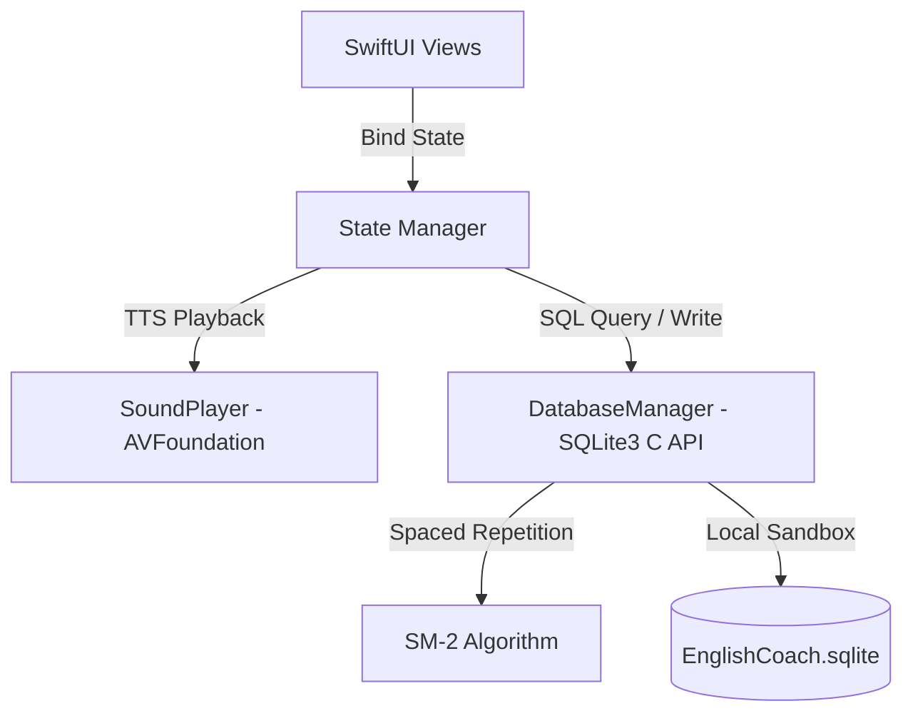

# EnglishCoach

EnglishCoach is a premium SwiftUI iOS application for scientific vocabulary learning, powered by a local SQLite database seeded with 3,000 TOEIC words and driven by the SM-2 Spaced Repetition algorithm.

## Features

- **TOEIC 3000 Vocabulary**: Seeding with 3,000 high-quality business English words categorized into *Beginner*, *Intermediate*, and *Advanced* levels.
- **SM-2 Spaced Repetition**: Scientific memory scheduling that dynamically calculates review intervals based on response accuracy.
- **Native SQLite**: Fully local storage using raw C `sqlite3` APIs with thread-safe operations, transactions, and auto-migration schemas.
- **Offline Pronunciation**: High-quality standard English text-to-speech engine powered by iOS's native `AVSpeechSynthesizer` without internet dependencies.
- **Smart Review Center**: A unified screen combining spaced repetition due words and user mistakes with correct answers decrementing review cycles in real-time.

## Screenshots

| Dashboard | Vocabulary Card | Quiz Mode | Review Center |
| :---: | :---: | :---: | :---: |
|  |  |  |  |

## Architecture

- **SwiftUI**: Uses declarative UI grids, spring animations, and `.rotation3DEffect` to construct a smooth 3D flipping card interface.
- **SQLite**: Direct interaction with iOS's C `sqlite3` library. Implements fast bulk-loading transactions (inserting 3,000 words in under 0.1s) and dynamic database updates.
- **AVSpeechSynthesizer**: Offline text-to-speech audio rendering via `AVFoundation`, properly integrated with iOS `AVAudioSession` categories.
- **SM-2 Algorithm**: Recalculates `easiness_factor`, `repetition_count`, and `next_review_date` dynamically upon answering ($q = 4$ for correct, $q = 1$ for incorrect answers).

## Installation

1. Clone or download this repository.
2. Open **Xcode** (v13 or newer).
3. Go to **File > Open...** and select:
   `/Users/andy/EnglishCoach/EnglishCoach.swiftpm`
4. Select an iOS simulator (e.g. **iPhone 16**) or a physical iOS device in the target selector.
5. Press **Cmd + R** (or click the Play button) to build and run!

## Roadmap

- [x] **CSV Import**: Core engine built using sub-second transaction queries to import large datasets.
- [ ] **Daily Notifications**: Local push reminders scheduling study alarms for optimal daily retrieval.
- [ ] **WidgetKit**: Home screen widgets displaying daily word cards and circular goal rings.
- [ ] **Cloud Sync**: iCloud / CloudKit database synchronization across multiple iOS and iPadOS devices.

## License

This project is licensed under the MIT License - see the LICENSE file for details.
